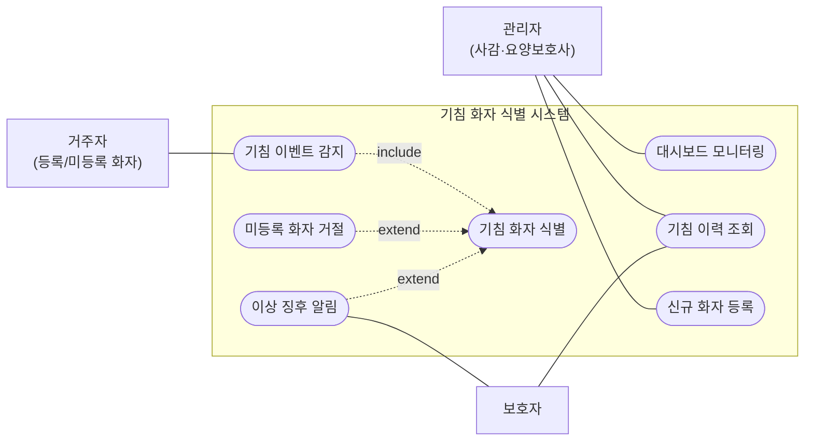
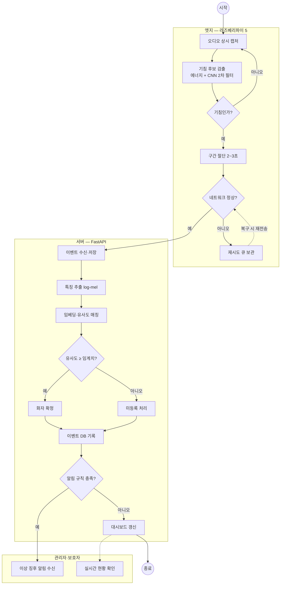
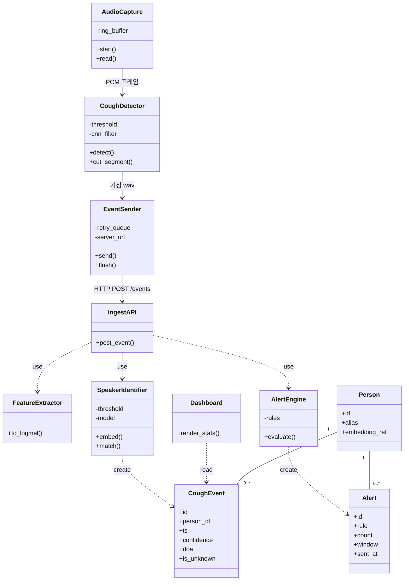
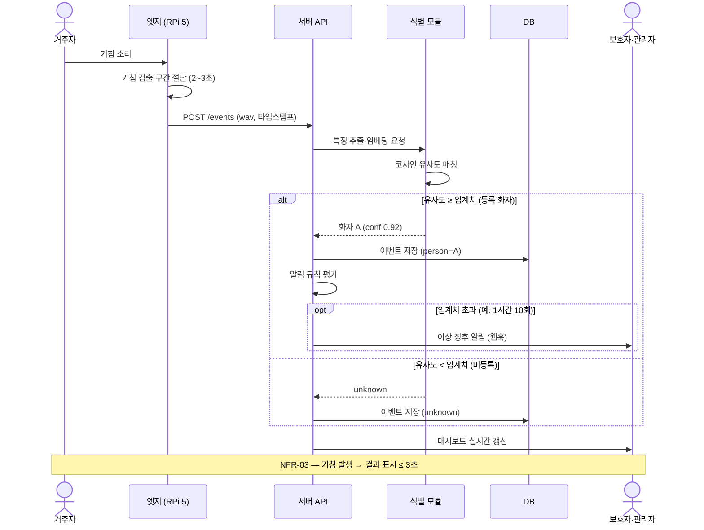

# UML 다이어그램 4종 — 기침 소리 기반 화자 식별 시스템

> 작성일: 2026-07-02 · 연계: 개발 생명주기 7단계(3.6절), FR-01~10
> 노션 "제 26회 임베디드 소프트웨어 경진대회" 페이지에 동일 내용 공유됨.

## 1. Use Case 다이어그램

- 거주자: 기침으로 시스템을 트리거하는 수동적 액터(무조작·비착용).
- 관리자: 대시보드(FR-08)·이력 조회(FR-06)·화자 등록(FR-09). 보호자: 알림 수신(FR-07)·이력 조회.
- 감지 «include» 식별(항상 실행), 미등록 거절·이상 징후 알림은 «extend»(조건부).

## 2. Activity 다이어그램

분기 4개가 핵심: 기침 판정(TC-03), 네트워크 재시도(TC-05), 임계치 기반 식별/거절(FR-04·05, 양쪽 모두 DB 기록), 알림 규칙(FR-07). 엣지는 검출·전송까지만, ML은 서버 — 엣지-서버 분담 구조.

## 3. Class 다이어그램

생명주기 3.3·3.4 기반. 엣지는 단방향 파이프라인(단위 테스트 용이), 서버는 IngestAPI 진입점 + «use» 호출(모델 교체 시 무수정), Person은 alias·embedding_ref만 저장(NFR-06 익명화), is_unknown으로 미등록 기침도 기록.

## 4. Sequence 다이어그램

TC-01·02 통합 시나리오. alt = 등록/미등록 상호 배타 분기, opt = 알림 규칙 충족 시에만(TC-04). 전 과정 지연 목표 NFR-03 ≤ 3초. 발표 데모 대본으로 사용 가능.
