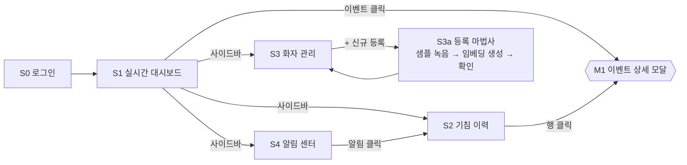

# 스토리보드 & 와이어프레임 — 기침 화자 식별 시스템 (웹 대시보드)

> 작성일: 2026-07-02 · 연계: UML 다이어그램 4종, FR-01~10, NFR-03·06
> 대상: 관리자(사감·요양보호사) 웹 대시보드. 보호자는 알림 웹훅 + 이력 조회(읽기 전용) 접근.

## 1. 화면 목록

| ID | 화면 | 연계 요구사항 | 주 사용자 |
|----|------|--------------|-----------|
| S0 | 로그인 | NFR-06 (접근 제어) | 관리자·보호자 |
| S1 | 실시간 대시보드 | FR-08, NFR-03 | 관리자 |
| S2 | 기침 이력 조회 | FR-06 | 관리자·보호자 |
| S3 | 화자 관리 / 신규 등록 | FR-09 | 관리자 |
| S4 | 알림 센터 & 규칙 설정 | FR-07 | 관리자 |
| M1 | 이벤트 상세 (모달) | FR-04·05 | 관리자 |

## 2. 화면 흐름도

## 3. 화면별 스토리보드

### S0 로그인
- 구성: 시스템 로고·명칭, 아이디/비밀번호 입력, 로그인 버튼, 역할 안내 문구.
- 동작: 인증 성공 시 역할에 따라 분기 — 관리자→S1, 보호자→S2(읽기 전용).
- 근거: NFR-06 익명화·접근 제어. 기침 데이터는 건강 민감 정보이므로 인증 필수.

### S1 실시간 대시보드 (메인)
- 상단 KPI 카드 4개: 오늘 기침 횟수, 활성 알림 수, 등록 화자 수, 엣지 디바이스 상태(온라인/오프라인).
- 좌측: 시간대별 기침 발생 추이 차트(24h 막대).
- 우측: 실시간 이벤트 피드 — 최신 기침 이벤트가 위로 쌓임(화자, 시각, 신뢰도, 미등록 여부 뱃지).
- 상단 배너: 알림 규칙 충족 시 빨간 경고 배너(예: "301호 A님 1시간 내 10회 — 이상 징후").
- 동작: 기침 발생→피드 갱신 ≤ 3초(NFR-03, WebSocket). 피드 항목 클릭→M1.

### S2 기침 이력 조회
- 필터 바: 기간(오늘/7일/30일/직접), 화자 선택, 미등록 포함 여부.
- 요약 차트: 화자별 일자별 기침 횟수 추이(라인).
- 테이블: 시각 · 화자(alias) · 신뢰도 · DOA(방향) · 미등록 여부 · 오디오 재생 버튼.
- 동작: 행 클릭→M1. CSV 내보내기 버튼. 보호자 계정은 담당 거주자만 표시.

### S3 화자 관리 / 신규 등록
- 등록 화자 카드 목록: alias, 등록일, 샘플 수, 최근 기침 시각, 삭제/재등록 버튼.
- [+ 신규 등록] → 3단계 마법사(S3a):
  1. alias 입력 (실명 대신 별칭 — NFR-06)
  2. 기침 샘플 녹음/업로드 (최소 N회, 진행 게이지)
  3. 임베딩 생성 결과 확인 → 완료
- 근거: FR-09. embedding_ref만 저장, 원본 음성 비보존 원칙 표기.

### S4 알림 센터 & 규칙 설정
- 좌측: 알림 이력 리스트(규칙명, 대상 화자, 발생 시각, 웹훅 발송 상태).
- 우측: 규칙 편집 — 조건(횟수 임계치, 시간 창), 대상, 수신 채널(웹훅 URL) 추가/삭제/활성 토글.
- 동작: 알림 클릭→해당 시간대 필터가 적용된 S2로 이동. 근거: FR-07.

### M1 이벤트 상세 (모달)
- 파형 + 스펙트로그램 미리보기, 오디오 재생.
- 식별 결과: 화자 alias, 코사인 유사도 점수, 임계치 대비 게이지, 미등록 사유(해당 시).
- 관리자 액션: "화자 수정"(오식별 보정), "이 샘플로 재학습 큐 등록".

## 4. 대표 시나리오 스토리보드 (이상 징후 알림)

| # | 장면 | 화면 | 내용 |
|---|------|------|------|
| 1 | 거주자 기침 반복 | — | 301호 거주자 A, 1시간 내 10회 기침 |
| 2 | 실시간 반영 | S1 | 이벤트 피드에 기침 이벤트 연속 표시, KPI 카운트 증가 (≤3초) |
| 3 | 규칙 충족 | S1 | 상단 빨간 배너 "이상 징후: A님 10회/1h", 알림 웹훅 발송 |
| 4 | 보호자 수신 | (외부) | 웹훅 메시지 수신 → 링크 클릭 |
| 5 | 이력 확인 | S2 | 해당 시간대 자동 필터, A님 기침 추이 급증 확인 |
| 6 | 상세 검토 | M1 | 신뢰도 0.92, 오디오 재생으로 육안(청각) 검증 |
| 7 | 조치 | S4 | 알림 처리 완료 표시, 필요 시 규칙 임계치 조정 |

## 5. 와이어프레임

- Figma 파일: https://www.figma.com/design/QZqWEFYVcZ9v7PivBMDngL (S0·S1·S2·S3·S3a·S4·M1 총 7화면, 1440×900)
- 공통 레이아웃: 좌측 사이드바 내비게이션(대시보드/이력/화자/알림) + 상단 헤더(시스템명, 디바이스 상태, 계정) + 콘텐츠 영역. 데스크톱 1440px 기준.
